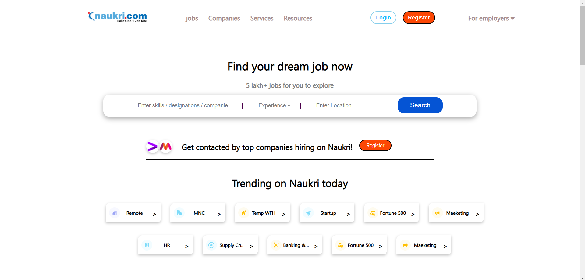
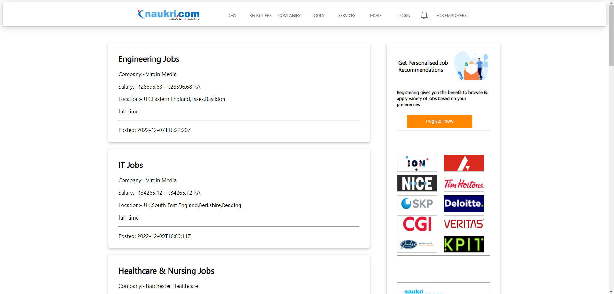
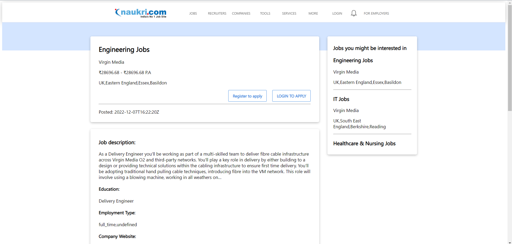
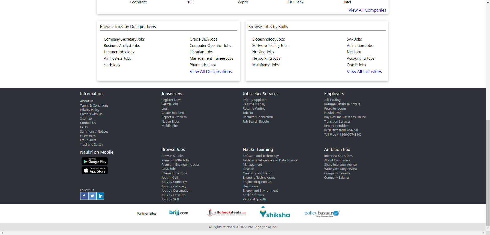

# Naukri.com -- Clone
Naukri.com is an Indian employment website operting in India and Middle East. It was founded in March 1997 by Indian bussinessman Sanjeev Bikhchandani. Naukri.com is the largest employment website in India.
 
The Naukri.com website has been cloned by myself and my team of 5 members project of our construct week at **Masai School** over 5 days.
### Project Code:- delicious-vacation-7867

## Technology
- HTML, CSS, JavaScript.
- **Version control:** Git and GitHub.
- **Hosting:** Netlify

## Features
- Multi-level interaction in the sign-up process for users to know their needs and to provide service accordingly
- Password strength given by the user is displayed live.
- Sign-in for users.
- Search for jobs

## Snapshots of the project

1. Landing page and navigation bar

*******************************************************************************

2. Naukri.com all jobs page

*******************************************************************************

4. Signup page

*******************************************************************************

5. SignIn Page

*******************************************************************************

6. Jobs Detail Page

*******************************************************************************

7. Footer section

*******************************************************************************

## Authors
#### Sushant Kumar
> Github: [Sushant Kumar](https://github.com/sushantkr961)
Team lead, daily POC and worked on footer, all jobs page, jobs detail page, job category page

#### Rajesh Byagalwar
>Github: [Rajesh Byagalwar](https://github.com/rajeshbyaga)
worked on Home Page

#### Kunal Chitatwar 
>Github: [Kunal Chitatwar ](https://github.com/kunalchitatwar)
worked on Login, Register, Profile Page

#### Ayush Bajpai
>Github: [Ayush Bajpai](https://github.com/ayush19031998)
worked on Services Page

#### Ramkezh Premarajan
>Github: [Ramkezh Premarajan](https://github.com/Ramkezh)
worked on Resources Page

